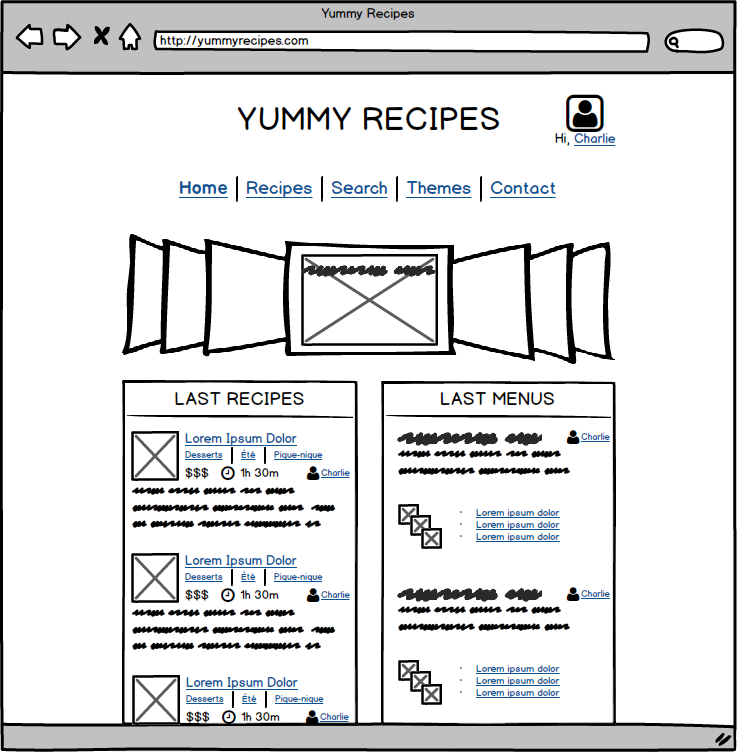
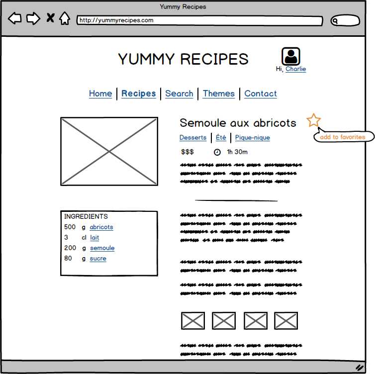
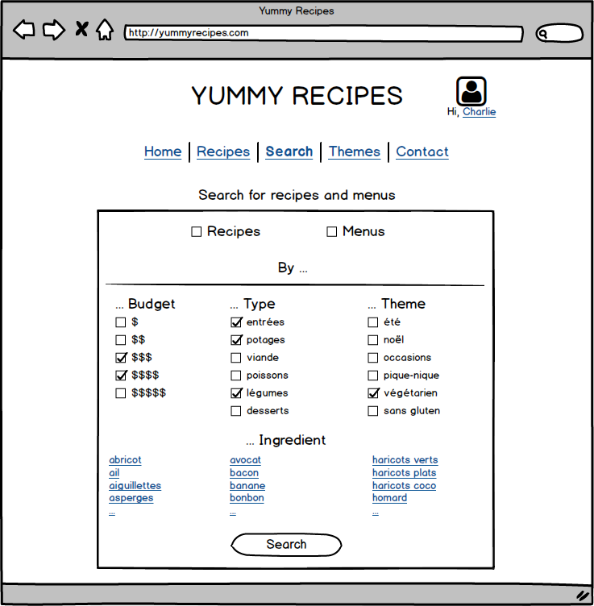
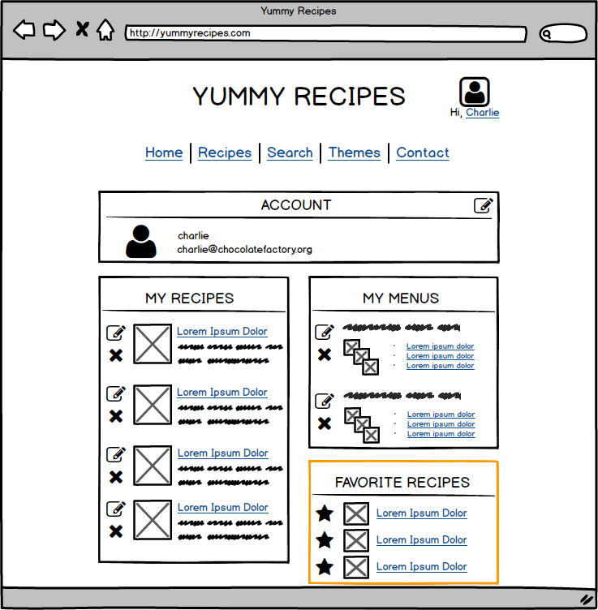

# Yummy Recipes
*compétences : Concevoir et mettre en place une base de données*

Vous arrivez sur le projet "Yummy Recipes", nouveau blog de recettes bientôt lancé par un fabricant de produits pâtissiers pour promouvoir sa marque (discrètement).  

Le chef de projet a déjà produit les wireframes sur la base d'entretiens avec le client. Pendant que le designer planche sur les "vraies" maquettes, Vous récupérez les wireframes et les instructions pour vous avancer sur le dev et créer la base de données.  

### Objectif
A partir des maquettes et instructions qui vous sont fournies, créez:
1. le dictionnaire des données,
2. le schéma entité-association (au format image),
3. la structure de la base de données physique (sous forme d'un fichier sql).

### Instructions

* Les utilisateurs inscrits peuvent proposer des recettes, et des menus.

* Ils peuvent aussi inscrire des recettes dans leurs "recettes favorites".

* Une recette comprend un titre, une photo, une description courte, des instructions.
Elle peut être catégorisée selon différents aspects: le budget, le type (entrée, dessert...), le thème (fêtes, pique-nique, facile, ...)  

Lorqu'il décrit sa recette l'utilisateur doit choisir pour chaque ingrédient:
- le nom de l'ingrédient (pour être sûr qu'il ne se trompe pas, il choisit dans une liste pré-établie)
- la quantité numérique (ex: 500 pour 500 g)
- l'unité de mesure de la quantité (ex: grammes, centilitres, cuillère à soupe, etc ), elle aussi choisie dans une liste pré-établie

* Un menu est caractérisé par un titre, une description, et composé d'une liste de recettes. Il peut être aussi catégorisé selon le budget et le/les thèmes.

**BONUS**. Le client demande à la dernière minute de rajouter un système de commentaires aux recettes, disponible pour les membres inscrits, pour capter plus de contacts de prospects. Indiquez les changements à apporter à votre structure (ou modifiez le schéma et ré-exportez votre BD).

### Conseils
* Lisez tout l’énoncé dès le début, et parcourez bien les maquettes pour savoir où vous allez.
* Faites le schema Entité/Association avec l'outil de votre choix (Google Drawings, [MySQL Workbench](https://www.mysql.com/products/workbench/) ...)  
* Si vous avez un doute sur l'interprétation d'une demande du client, faites ce qui vous paraît le plus pertinent et faites un commentaire pour expliquer votre choix à destination du chef de projet (toujours en week-end).

### Maquettes
4 maquettes ont été produites:  
* l'accueil du blog
* la page d'une recette
* la page de recherche d'une recette ou d'un menu
* la page *compte* d'un utilisateur

